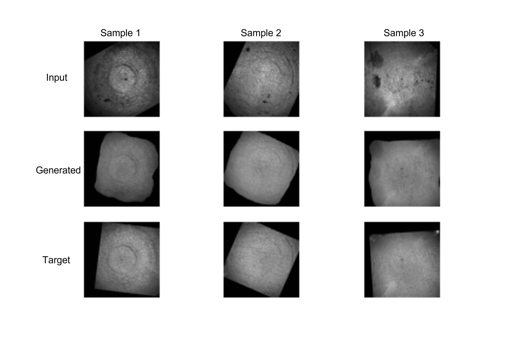

# Enhancing Wood Log Surface Quality for Siamese Network-Based Identification Using Pix2Pix GAN

This project addresses a critical challenge in the wood processing industry – the accurate identification of wood logs despite damage and variations caused by processing conditions. This innovative work leverages state-of-the-art deep learning techniques, specifically Pix2Pix Generative Adversarial Networks (GANs), to transform degraded wood log images into pristine representations which enhances the visibility of the annual ring patterns for identification. The resulting enhanced images are then seamlessly integrated into a Siamese Network for precise and reliable wood log identification.

## Project Goals and Highlights:

1. __Image Restoration with Pix2Pix GAN:__ The project showcases the powerful capabilities of Pix2Pix GANs to restore damaged and deteriorated wood log surface images. This image-to-image translation technique effectively removes the adverse effects of damage and processing conditions, thereby improving the quality of the visual data for its application as an input to the Siamese Network.

2. __Siamese Network for Wood Log Identification:__ A Siamese Network is employed to compare and identify the enhanced wood log images, enabling robust and precise identification even in challenging scenarios. The Siamese Network can verify the similarity or dissimilarity between the enhanced images, making it a valuable tool for quality control and wood log tracking.

3. __Industrial Application:__ This project has significant implications for the wood processing industry. The enhanced wood log images serve as a crucial input for quality control, inventory management, and process optimization. By reliably identifying wood logs based on their enhanced visual features, it becomes possible to enhance efficiency and reduce waste in the industry.

4. __Machine Learning Innovation:__ The project showcases an innovative approach to leveraging deep learning in the industrial context. By combining the power of GANs for image restoration and Siamese Networks for identification, it demonstrates the potential of cutting-edge machine learning techniques in solving real-world challenges.

5. __Future Expansion:__ The work opens up avenues for further research and development in the application of advanced deep learning techniques for industrial image analysis. Future work may include additional feature extraction methods, improving network architectures, and integrating the system into wood processing facilities.

# Demo Result

## Dataset Notice

Please note that the dataset used in this project is proprietary and owned by a company client of Fraunhofer IPM. Unfortunately, we are unable to provide public access to the dataset due to legal and confidentiality agreements. The focus of this repository is to showcase the code, methodology, and results derived from the dataset.

This is a test output after training the model with the company dataset from the forest and the test image is obtained from Google.

